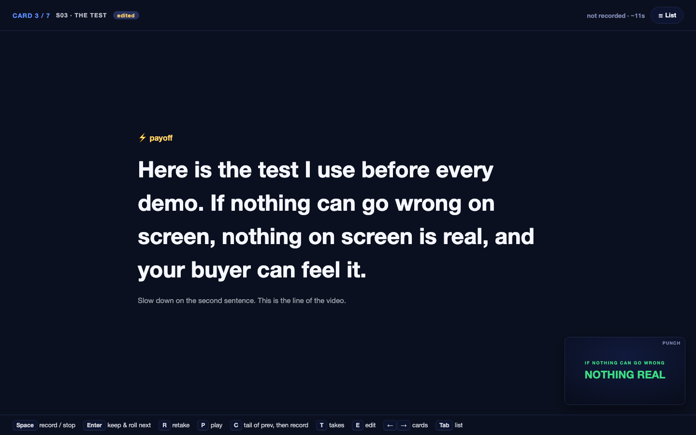
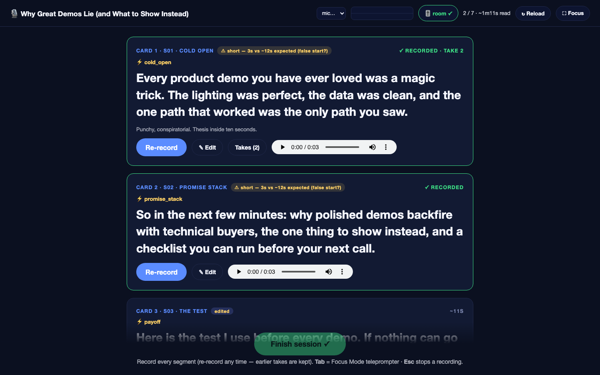
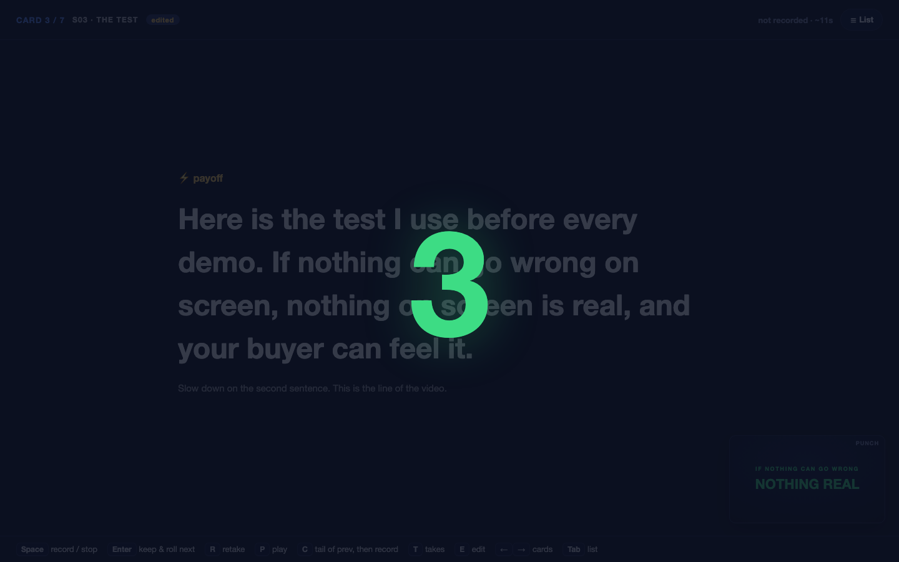
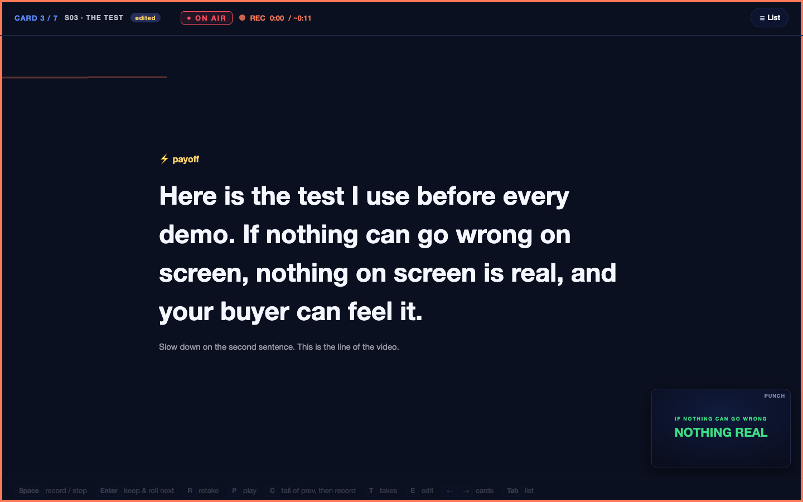
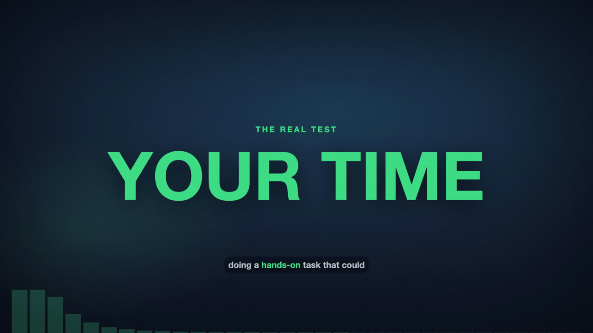
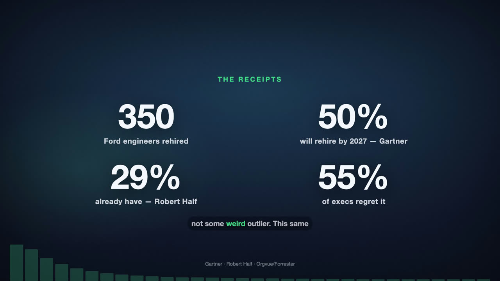
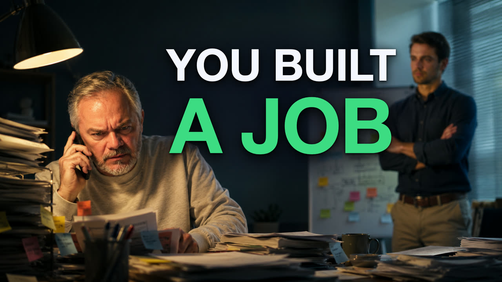

# Explainer Studio — a local-first explainer-video studio

> Type in a topic. Get back a YouTube-ready deep dive **and** a stack of Shorts — researched against the competition, scripted to keep people watching, narrated in **your** voice, and dressed in real motion graphics. All on one Mac. **Zero SaaS subscriptions in the pipeline.**

<!-- badges: license · stars · (later) release -->

**Status: working and in daily use.** It takes a topic and produces finished, packaged videos end-to-end on an Apple-Silicon Mac — no cloud render, no per-token bill. [PRD.md](PRD.md) is the source of truth for scope and build phases. The proven v1, [`video-explainer-system`](https://github.com/nemock/video-explainer-system), is still its own production tool; this is a ground-up successor whose media core was vendored once from v1 and has since happily diverged.


*Focus Mode in the built-in recording booth: one card at a time, delivery cues, a live preview of the slide you're narrating over, and a fully keyboard-driven record loop.*

---

## Why this exists

The usual way to "automate" explainer videos is to rent four or five clouds: a voice subscription, a stock-footage plan, an avatar tier, a render-credit meter that ticks every time you change your mind. [v1](https://github.com/nemock/video-explainer-system) proved you don't need any of them. Local TTS (Kokoro), local forced alignment, a headless browser, and ffmpeg already make a finished, captioned, branded video on an M3 — with the "LLM bill" being an **existing Claude subscription** you already pay for. No API key. No metering.

Explainer Studio keeps that conviction and asks the harder question. Not *"how do I make a video?"* — that part's solved — but *"how do I make the video that **wins**: the one people click, keep watching, and that actually grows a channel?"*

Everything below is built to run that play, on your machine, on your terms.

## What it does today

**1. It scouts YouTube before writing a single word.** 🔍
Hand it a topic. It pulls comparable videos, scores the breakout outliers against their *own* channel's baseline (so a small channel's banger isn't drowned out by a big channel's average), and reverse-engineers what's working — titles, hooks, structure, thumbnails, descriptions. Then it names the gap every one of them left open. You read the **Blueprint** and approve the angle before anything gets scripted.

**2. It writes scripts engineered to hold attention.** ✍️
Cold-open hook, open loops that pay off later, re-hook beats at the dips, pattern interrupts — the actual retention craft, not filler. It writes in *your* voice (pulled from a talk-time library of your real takes and one-liners) and hands you the script next to its retention map so you can see *why* each beat is there before you touch it.

**3. It records in your real voice — in a booth that behaves like a studio.** 🎙️
A built-in browser recording booth with a full-screen **Focus Mode teleprompter**: `Space` counts you in 3-2-1 (no more clipped first words), you read, and `Enter` accepts the take and rolls straight into the next card — one key between cards, start to finish. Every take gets an **instant audio QC badge** (clipping, too quiet, longer than the read-time target), a local **Whisper** pass badges each card *verbatim / ad-lib N% / re-record* with a word-level diff, and a **room-tone check** rates your noise floor before you start. Found a clunky line on the prompter? Edit it right there — it writes back to the script. Takes are archived with a promote-any-take manager, and Finish hands you a session wrap report. Don't feel like talking today? Local **Kokoro** TTS is the fully-headless fallback — same align → render path either way. [See it below.](#inside-the-recording-booth)

**4. It builds motion graphics that *perform* the explanation.** 🎬
A deterministic **Remotion** (React/TS) component library where every pixel is a function of time, audio, and data: numbers that *count up* as you say them, charts that *build* on the cue, documents that *highlight* as they're read, diagrams that *assemble*, 3D scenes, kinetic word-synced captions, a music bed that auto-ducks under your voice. Need real footage? A guided **Adobe Stock** workflow suggests searches, you license and drop the files, and it ingests and conforms them — and every footage scene has a designed fallback so a render never breaks on a missing clip.

**5. It ships two formats from one project.** ✂️
A chapter-marked **16:9 deep dive** *and* **9:16 Shorts** cut from its strongest beats. The Shorts aren't lazy clips — each gets its own natively-recorded hook and outro (you record them in the same booth session) and a CTA pointing back to the long-form.

**6. It packages the whole thing for upload.** 📦
Locally rendered thumbnail candidates (both the brand-template cutout *and* illustrative composed scenes), intelligence-ranked titles, an SEO-shaped description with chapters and your book CTA, tags, a pinned comment, an end-screen plan — and a written companion **article** de-spoken from the script for your blog or newsletter. It all lands in a versioned `manifest.json` that any downstream poster can read.

**7. It re-shares your greatest hits.** 🔁
The `promote` command reaches into your back catalogue, picks an already-published Short, writes a fresh caption, and re-shares it across platforms via Blotato — **dry-run by default**, `--fire` to actually post, every promotion logged in `promotions.json`. This is the *one* place the studio touches social, and only for videos you already put out yourself.

## Inside the recording booth

The booth is a local web app the pipeline serves on demand — no external recording software, and the whole session runs from the keyboard.

| | |
|---|---|
|  |  |
| *The card list: per-take audio-QC chips, take counts, inline edit, room-tone badge, mic picker.* | *`Space` counts you in — first words never get clipped.* |
|  |  |
| *Rolling: ON AIR lamp, live waveform behind the text, elapsed vs. target pace.* | *Focus Mode: delivery cues, the note from the script author, and a mini-preview of the slide this line narrates.* |

Under the hood: takes save per segment as WAV, archived on every retake (nothing is ever overwritten); a serialized Whisper worker checks each take against the script and defers automatically while a video render holds the machine's render lock; and the booth server survives you walking away — it launches detached under `caffeinate`, so an idle Mac never kills a session. One booth serves **every** channel: the same launcher records the flagship deep dives here and the daily/weekly short-form skills that feed other outlets.

## What comes out the other end

Frames from published videos rendered by the Remotion motion engine — deterministic, brand-locked, driven entirely by the script's timing data:

| | |
|---|---|
|  |  |
| *A `punch` beat landing the midroll thesis.* | *A `statgrid` — four sourced numbers springing in on cue.* |

And the package ships upload-ready A/B thumbnails (the composed-scene style — the operator generates an AI base image, the studio composites the brand headline):



## The one rule: generation stops at the package

Producing a video **ends at a labeled output directory + a versioned manifest** — it never auto-posts your fresh work. You stay in the loop for the publish. The single, deliberate exception is `promote` (#7 above), which only re-shares Shorts you've *already* published. New videos always stop at the package, every time.

## The stack (local & free)

| Capability | Tool |
|---|---|
| LLM (research, blueprint, script, packaging copy) | **Claude subscription** via Claude Code / Agent SDK — no API key |
| YouTube intelligence | `yt-dlp` (metadata, transcripts, thumbnails — no API quota) |
| Text-to-speech (fallback tier) | Kokoro-82M, local |
| Your voice | Browser teleprompter/recorder + local ffmpeg cleanup chain |
| Word-level timing | torchaudio forced alignment (Apple-Silicon-native) |
| Ad-lib transcription | Whisper (mlx, Metal-native) — live drift badges in the booth + the post-session ad-lib check |
| Motion graphics (default engine) | **Remotion** (React/TS), rendered headless — deterministic via `useCurrentFrame`/`interpolate`/seeded RNG |
| Legacy visuals (`--engine deck`) | HTML/CSS/JS layer stack, captured via headless Chrome |
| Encode | ffmpeg + VideoToolbox (hardware) |
| Thumbnail headshot cutout | `rembg` (local U²-Net) |
| Stock footage | **Your stock.adobe.com membership** — guided, human-in-the-loop (the one subscription) |

Target machine: Apple Silicon (developed on an M3 / 16 GB). No CUDA, no cloud render.

## Dependencies

Everything the pipeline depends on runs **locally** and is **free**. The one declared exception is the operator's existing stock.adobe.com membership, which is human-in-the-loop and never an API dependency. No cloud render, no per-token billing, no SaaS in the critical path.

**System tools** (install once via Homebrew / nvm):

- **Python ≥ 3.12** — the pipeline runs on the shared `~/myenv` interpreter, which already holds the verified multi-GB torch/Kokoro/Playwright stack. `bin/explainer2` wraps it; no install into the venv is needed.
- **ffmpeg** (with VideoToolbox) — audio cleanup, hardware encode, mux. `brew install ffmpeg`.
- **Node.js ≥ 20 + npm** — for the Remotion motion engine. `brew install node` or nvm.
- **yt-dlp** — YouTube intelligence (metadata/transcripts only; no API key). `brew install yt-dlp`.

**Python packages** (pinned in [pyproject.toml](pyproject.toml), already present in `~/myenv`):

`kokoro` · `torch` / `torchaudio` · `soundfile` · `numpy` · `playwright` · `pymupdf` · `yt-dlp` · `rembg`

**Node packages** (the Remotion engine — `cd remotion && npm install`):

`remotion` + `@remotion/cli` / `media-utils` / `three` / `transitions` · `react` / `react-dom` · `@react-three/fiber` + `three` (3D scenes) · `zod` (spec schema). Versions pinned in [remotion/package.json](remotion/package.json).

**LLM** — your **Claude subscription** through Claude Code / the Agent SDK (subscription auth). Never an API key, never per-token billing. Claude touches only the *generation* stages (intel synthesis, blueprint, script, packaging copy, QA judgments); the media path (narrate → align → compose → render → mux) is pure Python with **zero LLM calls** and runs unattended.

## Render robustness (RAM-aware, multi-project-safe)

The render+mux stage — headless frame capture plus an ffmpeg encode — is the one memory-heavy part of the pipeline, and on a 16 GB machine two of them at once means an OOM kill mid-write. Three mechanisms keep it honest (see [`src/explainer2/renderlock.py`](src/explainer2/renderlock.py)):

- **RAM-aware serialization.** Memory-heavy stages are serialized by design — never Kokoro *and* headless capture *and* ffmpeg at the same time — so the encode fits the unified-memory budget instead of fighting it.
- **A machine-global render lock.** An `fcntl.flock` on a fixed lockfile (`/tmp/explainer-render.lock`) is shared across **every** explainer project *and* across codebases (this repo **and** the production v1). Start as many renders as you like, whenever you like — they queue and auto-start one at a time, so concurrent renders never kill each other. The OS releases the lock if a holder dies (even on `SIGKILL`), so a crashed render can't deadlock the queue. `bin/explainer2 render-status` shows who holds the lock and every live render.
- **Detached, suspend-proof launches.** Heavy renders launch in their own session under `caffeinate`, so suspending or closing the Claude app (or wandering off) leaves the encode running to completion instead of killing it mid-frame.

Hard rule for contributors: never invoke a heavy ffmpeg encode raw — route it through `renderlock.run_locked(...)` so it serializes against scheduled renders.

## Quick start

```bash
git clone https://github.com/nemock/explainer-studio && cd explainer-studio

# 1. Node side: install the Remotion motion engine
cd remotion && npm install && cd ..

# 2. Python side: the media stack lives in the shared ~/myenv interpreter
#    (torch / Kokoro / Playwright already installed there). bin/explainer2 wraps it.

# Run any pipeline stage via the wrapper:
bin/explainer2 scaffold "why vector databases forget"   # new project dir
bin/explainer2 intel <project-dir>                       # YouTube intelligence sweep
#   → Claude authors the Blueprint, script, deck.json/motion spec, and shorts plan (see the SKILL)
bin/explainer2 record <project-dir>                      # open the booth, record in your voice
bin/explainer2 media --only narrate,align <project-dir>  # light media stages (foreground)
bin/explainer2 render <project-dir>                      # heavy render — launches DETACHED
bin/explainer2 shorts <project-dir>                      # cut 9:16 Shorts from the finished deep dive
bin/explainer2 render-status                             # render-queue view
```

The end-to-end procedure, gates, and hard rules are written down in the skill (below) — the project is built to be run by **any** Claude model, so the methodology lives in the repo, not in any one session.

## Roadmap (what's coming next)

The pipeline above all works today from the CLI — including **Learn**, the results feedback loop (`bin/explainer2 learn refresh / ingest / report`): public stats via yt-dlp plus optional YouTube Studio CSV exports build a local memory of which titles and structures actually perform on *your* channel, and the next Blueprint reads the report before ranking titles. One PRD phase is still in flight:

- **Mission Control (PRD Phase 4) — a local web GUI.** A FastAPI + HTML/JS app (served from the Mac, opened in Chrome) where every project is a card moving across a board — Intel → Blueprint → Script → Voice → Assets → Compose → Render → Package — with the review gates, the recording booth, the Adobe Stock asset queue, render progress, and the final package preview all in one place. Every action it adds will have the CLI twin it already wraps. *Not built yet — today the same gates run from the terminal.*

## Documentation

The analytical methodology is documented as a **skill + playbooks** so the pipeline is reproducible by any operator (human or model):

- [PRD.md](PRD.md) — full product spec, architecture, risks, build phases
- [skills/explainer2/SKILL.md](skills/explainer2/SKILL.md) — the pipeline procedure, gates, and hard rules
- [skills/explainer2/references/blueprint-playbook.md](skills/explainer2/references/blueprint-playbook.md) — intel sweep → Blueprint
- [skills/explainer2/references/script-playbook.md](skills/explainer2/references/script-playbook.md) — retention engineering + voice rules
- [skills/explainer2/references/spoken-humanizer.md](skills/explainer2/references/spoken-humanizer.md) — the pre-booth spoken-language pass
- [skills/explainer2/references/motion-playbook.md](skills/explainer2/references/motion-playbook.md) — the Remotion motion engine
- [skills/explainer2/references/deck-playbook.md](skills/explainer2/references/deck-playbook.md) — the legacy deck engine
- [skills/explainer2/references/thumbnail-playbook.md](skills/explainer2/references/thumbnail-playbook.md) · [article-playbook.md](skills/explainer2/references/article-playbook.md) · [shorts-playbook.md](skills/explainer2/references/shorts-playbook.md) — packaging
- [docs/booth-upgrade-plan.md](docs/booth-upgrade-plan.md) — the Booth 2.0 build plan (all five batches shipped 2026-07-03)
- [docs/examples/](docs/examples/) — a worked Blueprint example

## Boundaries (choices, not gaps)

- **Generation stops at the package** — output is a labeled directory + manifest; pair it with your own poster. The only social touch is `promote`, which re-shares Shorts you already published.
- **No avatars, no voice cloning, no photoreal generative video** — your real voice is the premium tier.
- **No cloud anything** — single operator, single Mac, files on disk.
- **v1 untouched** — this project never reads from or writes into `video-explainer-system`.

## License

[MIT](LICENSE).

---

*Built as a Claude Code project. Local-first, subscription-only, and — apart from re-sharing your own published Shorts — it stops at the package and lets you press publish.*
